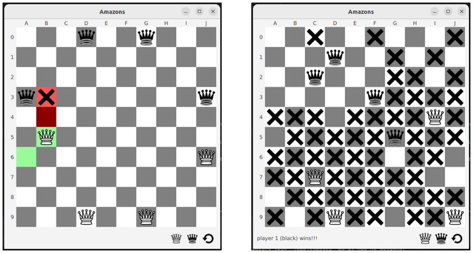
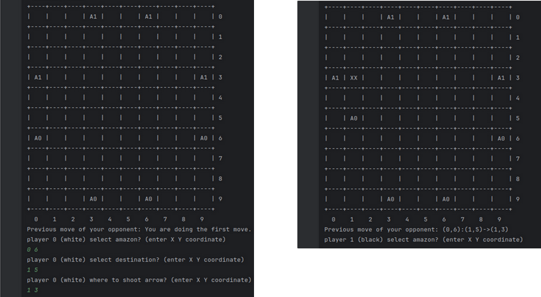

## Project Description
This project is about implementing the game Amazons.
It's a two player strategy game played on a checkerboard or chessboard.
The goal is to capture your opponent's pieces.
A move consists of two steps: moving a piece and shooting an arrow at a square.
The square is then inaccessible to other players' pieces for the rest of the game.
The winner is the last player to complete a move.  

## Project details
The game is playable with 2 real players (local), 1 real player VS 1 AI (3 difficulty modes) or AI VS AI. 
The project was developed during the third semester at the University of Aix-Marseille (2023-2024).

## Project Members
- FANANI Amina
- MARCUCCINI Fabien

## Preview

